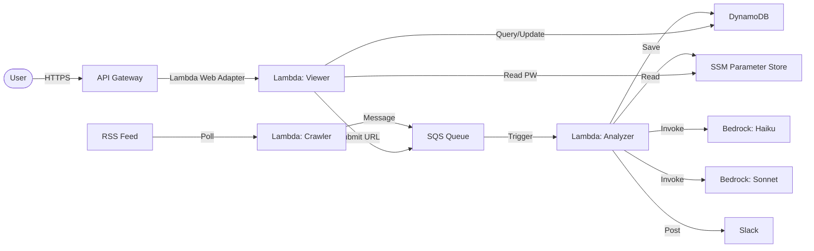

# Threat Sifter

Threat Sifter is an automated threat intelligence tool that crawls news articles, extracts and summarizes information regarding IoAs (Indicators of Attack), IoCs (Indicators of Compromise), and malware behaviors, and notifies Slack.

## Overview

This tool automatically collects the latest security threat information and uses AI to triage and analyze the data in detail. It aims to help security operators and researchers efficiently identify critical threat information from a large volume of news articles.

### Architecture

The system adopts an AWS Serverless architecture and processes data in the following flow:

1.  **RSS Crawler**: Periodically checks RSS feeds to detect new articles.
2.  **Triage**: Rapidly determines if the found articles contain threat information (IoA/IoC, etc.) using a lightweight AI model.
3.  **Analysis**: Performs detailed analysis on important articles using a high-performance AI model to summarize contents and extract entities.
4.  **Notification**: Sends alerts to Slack if the analysis results meet the notification criteria.

## Features

### 1. RSS Crawler
- **DynamoDB**: Manages the list of sites to crawl and the last check timestamp for each site.
- Crawls RSS feeds of specified security news sites.
- Detects new articles (articles published after the last check) and adds them to a processing queue (SQS).

### 2. Triage (Simple Analysis)
- **Model Used**: Amazon Nova Lite (Bedrock) - *Default, configurable*
- **Purpose**: To determine if an article contains specific security threat information while keeping costs and time low.
- **Criteria**: Checks for the presence of specific attack methods, IoCs, or IoAs.
- **Process**: Fetches full article content (falling back to summary if failed) to improve accuracy.

### 3. Analysis (Detailed Analysis)
- **Model Used**: Claude 4.6 Sonnet (Bedrock) - *Default, configurable*
- **Purpose**: To deeply understand the article content and extract useful information in a structured format.
- **Process**: Perform detailed analysis on the full article content.
- **Output**: The summary of the analysis result is generated in **Japanese**.
- **Traceability**: A unique ID (Request ID) is assigned to each analysis request, linking logs and notifications.
- **Notification Criteria**: Alerts are sent if the article contains:
    - Attack Methods (IoA)
    - Indicator Information (IoC)
    - Malware Behavior Information
- **Data Persistence**: Saves collected IoC information and analysis results to DynamoDB for future search and utilization.
- **Comparison**: Designed to allow comparison of outputs between models for future improvements and accuracy verification.

### 4. Notification
- Posts analysis results to a Slack channel.
- Includes the article title, summary (in Japanese), extracted IoC/IoA, and a link to the original source.
- Also includes **Request ID** and **Article ID** for debugging and tracking purposes.

### 5. Dashboard Viewer (FastAPI SPA)
- **Tech Stack**: FastAPI (Python 3.12) + HTML/CSS/JS (Vanilla SPA) + AWS Lambda Web Adapter (Docker Container).
- **Authentication**: Checks password input against a secure SSM Parameter Store value (`Type: SecureString`) and manages session token using browser LocalStorage.
- **Data Viewer**: Shows an interactive feed list with Read/Unread filters and search. Includes a details pane containing article metadata, summary, IoCs, IoAs, malware behavior, and raw Bedrock JSON response.
- **Workflow Tools**: Allow marking articles as Read/Unread, adding analysis feedback, and marking feedback as reviewed.
- **Site Feed Manager**: Register new feeds, toggle active status, trigger full historical recrawl, or delete site configurations.
- **Manual SQS Submission**: Manually queue a single article URL to the analyzer.
- **System Metrics**: Visualizes triage stats, threat counts, daily volumes, and distribution charts over time using `Chart.js` (CDN).

## CLI Tool (`manage.py`)

Use `manage.py` for system management and data access.
* Supports `--profile <AWS_PROFILE>` option.

### Data Initialization & Management
- **Seed Sites** (Single):
  `uv run manage.py site seed --url <RSS_URL> --name <SITE_NAME>`
  - `--url`: RSS feed URL
  - `--name`: Site Name
  - Note: Sets `last_checked_at` to `1970-01-01` to trigger a full historical fetch.
- **Seed Sites** (From File):
  `uv run manage.py site seed-from-file --file <JSON_PATH>`
- **List Sites**:
  `uv run manage.py site list`
  - Displays Site ID, URL, Status, and Last Checked time.
- **Delete Site**:
  `uv run manage.py site delete --id <SiteID>`
- **Toggle Site Status**:
  `uv run manage.py site toggle-active --id <SiteID>`
- **Set Last Checked Time (Trigger Re-crawl)**:
  `uv run manage.py site set-last-checked --id <SiteID> --time <ISO8601|epoch>`
  - Using `epoch` resets the time to `1970-01-01`, allowing re-crawling of past articles.
- **Seed Dummy Data**:
  `uv run manage.py dummy seed`

### Data Access
- **List Articles**:
  `uv run manage.py article list [--site-id <SiteID>]`
  - `--site-id`: Filter articles by a specific site (e.g., `site-<HEX>`)
- **Article Details**:
  `uv run manage.py article detail --url <ARTICLE_URL>`
- **List IoC/IoA/Malware**:
  `uv run manage.py ioc list` (also ioa, malware)
- **Search**:
  `uv run manage.py search --value <KEYWORD>`
- **Statistics**:
  `uv run manage.py stats [--days <N>]`
  - Uses DynamoDB (`TypeIndex`) to aggregate and display processing stats (Triage blocked, Analysis empty, Threats detected) for the specified period.
  - *Note*: Efficiently filters and aggregates only article data (`category='Article'`).

### Local Execution & Debugging
- **Crawler**:
  `uv run manage.py crawler run --queue-url <SQS_URL> [--triage-model <ID>] [--analysis-model <ID>]`
- **Analyzer**:
  `uv run manage.py analyzer run --event <EVENT_JSON_PATH> [--triage-model <ID>] [--analysis-model <ID>]`
- **Inspect Article Results (Debug Inspect)**:
  `uv run manage.py debug inspect --article-id <ArticleID>`
  - Displays article metadata, analysis results (JSON), and triage results (JSON).
  - Useful for inspecting LLM responses stored in DynamoDB.
- **Compare Triage Models (Debug Compare)**:
  `uv run manage.py debug compare-triage [--limit <N>] [--haiku-model <ID>] [--nova-model <ID>] [--ja]`
  - Compares the triage results between the Haiku and Nova models for the latest `N` articles.
  - Useful for evaluating the performance differences between models.
- **Prompt Tuning**:
  `uv run manage.py debug prompt-tuning --type <triage|analysis|all> --article-id <ArticleID> [--lang <en|ja>] [--prompt-file <PATH>]`
  - Test prompts using existing article data.
  - Does not save to database or send notifications.

## Deployment

Deploy using AWS SAM. Pass the Slack Webhook URL as a parameter. You can also configure the Bedrock Models.

```bash
sam build
sam deploy --guided
```

### Parameters
- `SlackTokenParameterName`: SSM Parameter Name for Slack Token (Default: `/threat-sifter/slack-token`)
- `ViewerPasswordParameterName`: SSM Parameter Name for Streamlit Viewer Password (Default: `/threat-sifter/viewer-password`)
- `TriageModelId`: Bedrock Model ID for Triage (Default: Amazon Nova Lite)
- `AnalysisModelId`: Bedrock Model ID for Analysis (Default: Claude 4.6 Sonnet)
- `AlertEmail`: Email address for error notifications (Optional)

The template retrieves the Slack Token and the Viewer Password from AWS Systems Manager Parameter Store by default.
**Please create these parameters (Type: SecureString) BEFORE deployment.**

You can create them using AWS CLI:
```bash
aws ssm put-parameter --name "/threat-sifter/slack-token" --value "YOUR_SLACK_HOOK_PATH" --type "SecureString" --overwrite
aws ssm put-parameter --name "/threat-sifter/viewer-password" --value "YOUR_VIEWER_PASSWORD" --type "SecureString" --overwrite
```
*You can override their paths using `SlackTokenParameterName` and `ViewerPasswordParameterName` parameters during deployment.*

## Design Decisions (Dashboard Viewer)

The dashboard UI was originally built using `Streamlit` but has been rewritten to **`FastAPI` + `Vanilla HTML/CSS/JS (SPA)`**. This architectural decision was made for the following reasons and benefits:

### 1. Eliminating WebSocket Dependency for 100% Stability
* **Background & Challenge**: Streamlit relies heavily on persistent, bi-directional WebSocket connections (`/_stcore/stream`). However, AWS Lambda and API Gateway (HTTP API) are stateless environments designed for request-response cycles. Maintaining WebSocket connections often leads to connection timeouts (such as the 30-second API Gateway limit), resulting in blank screens or constant reconnection loops.
* **Solution**: By rewriting the viewer to a standard HTTP-based **FastAPI API** and a static **HTML/CSS/JS Single Page Application (SPA)**, all client-server interactions are processed via standard HTTP Request-Response. It runs 100% reliably and fast through API Gateway or custom domains.

### 2. Lambda Web Adapter and API Gateway Optimization
* **Consolidated Routing**: API Gateway is configured with a wildcard proxy (`/{proxy+}`), which passes all requests to the Lambda function. FastAPI handles all endpoint routing internally. This allows us to collapse the entire viewer microservice into a single Lambda function (`ViewerFunction`), dramatically simplifying infrastructure deployment.
* **Portability**: Running the app locally (`uvicorn app:app`) uses the exact same code execution path as running inside the Lambda Web Adapter Docker container on AWS, facilitating local development.

### 3. Lightweight Frontend and Fast Performance
* **Client-Side Rendering**: Instead of rendering layout changes on the server side (like Streamlit), the client browser handles UI state and updates via Vanilla JavaScript, fetching JSON data from the FastAPI endpoints. Statistics are generated dynamically on the client side using `Chart.js` (loaded via CDN). This reduces Lambda memory footprint, execution time, and cold-start latency, while delivering a modern UX.

## Tech Stack

### Application
- **Language**: Python 3.12 (managed by uv)
- **Libraries**: `boto3`, `feedparser`, `requests`, `beautifulsoup4`, `pydantic`, `fastapi`, `uvicorn`

### AWS Infrastructure
- **Compute**: AWS Lambda (RSS Crawler, Analyzer)
    - **Crawler**: Injects model IDs into messages if configured (`TRIAGE_MODEL_ID`, `ANALYZER_MODEL_ID`).
    - **Analyzer**: Uses configured models or defaults (`DEFAULT_TRIAGE_MODEL_ID`, `DEFAULT_ANALYSIS_MODEL_ID`).
- **Database**: Amazon DynamoDB (Single Table Design)
    - **Table Schema**:
        - Partition Key (PK): `pk` (String)
        - Sort Key (SK): `sk` (String)
        - Global Secondary Indexes (GSI):
            - `StatusIndex`: PK=`status`, SK=`last_checked_at` (For site crawling)
            - `SiteIndex`: PK=`site_id`, SK=`published_at` (For fetching articles by site)
            - `IndicatorIndex`: PK=`indicator`, SK=`published_at` (For searching threat indicators)
            - `TypeIndex`: PK=`category`, SK=`published_at` (For listing recent threats by type)
    - **Entity Patterns**:
        - **Site**: PK=`site-<16HEX>`, SK=`META`, category=`Site`, status=`ACTIVE`, watcher=`threat-sifter`|`claude-cowork`|etc.
        - **Article**: PK=`article-<16HEX>`, SK=`META`, site_id=`site-<16HEX>`, category=`Article`
        - **Details(IoC/IoA/Malware)**: PK=`article-<16HEX>`, SK=`IOC#<16HEX>` / `IOA#<16HEX>` / `MALWARE#<16HEX>`
            - **Common Attributes**: `category` ("IoC", "IoA", "MalBehavior"), `published_at`
            - **IoC**: `type` (IP/Domain/etc.), `value`, `context`
            - **IoA**: `type` (Method/Command), `value`, `description`
            - **MalBehavior**: `malware_name`, `behavior`
            - **TypeIndex Usage**: Utilizing `category` as Partition Key enables fast search and aggregation per entity type.
            - **IndicatorIndex Usage**: Utilizing `indicator` (copied from `value` or `malware_name`) for specific value search.
- **Messaging**: Amazon SQS (Processing Queue)
- **Configuration**: AWS Systems Manager Parameter Store
    - Securely manages Slack Token (`/threat-sifter/slack-token`) and Viewer Password (`/threat-sifter/viewer-password`)
- **Monitoring**: Amazon CloudWatch Alarms & SNS
    - Notifies via email on Lambda errors (if `AlertEmail` parameter is set).
- **AI/ML**: Amazon Bedrock (Amazon Nova Lite, Claude 4.6 Sonnet)

## System Architecture (Conceptual)



## Future Extensibility

- Implementation of features to compare and evaluate analysis results from multiple AI models.
- Support for information sources other than RSS (Twitter/X, GitHub, etc.).
