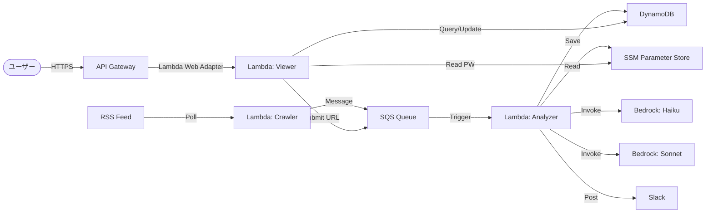

# Threat Sifter

Threat Sifterは、ニュース記事を巡回し、IoA（攻撃の兆候）、IoC（侵害指標）、マルウェアの挙動に関する情報を抽出・要約してSlackに通知する脅威インテリジェンス自動収集ツールです。

## 概要

このツールは、最新のセキュリティ脅威情報を自動的に収集し、AIを用いて情報の選別と詳細な解析を行います。セキュリティ運用者や研究者が、大量のニュース記事の中から重要な脅威情報を効率的に把握することを目的としています。

### アーキテクチャ

システムはAWSサーバーレスアーキテクチャを採用しており、以下のフローで処理が行われます。

1.  **RSS巡回**: 定期的にRSSフィードをチェックし、新しい記事を検出します。
2.  **記事の簡易解析**: 発見した記事が脅威情報（IoA/IoCなど）を含んでいるか、軽量なAIモデルで高速に判断します。
3.  **記事の詳細解析**: 重要な記事に対して高性能なAIモデルで詳細な解析を行い、要約と抽出を行います。
4.  **通知**: 解析結果が通知基準を満たす場合、Slackにアラートを送信します。

## 機能

### 1. RSS巡回
- **DynamoDB**: 巡回対象のサイトリストと、各サイトの最終確認日時を管理します。
- 指定されたセキュリティニュースサイトのRSSフィードを巡回します。
- 新規記事（最終確認日時以降の記事）を検出し、処理キュー（SQS）に追加します。

### 2. 記事の簡易解析 (Triage)
- **使用モデル**: Amazon Nova Lite (Bedrock) - *デフォルト、設定可能*
- **目的**: コストと時間を抑えつつ、記事がセキュリティ上の具体的な脅威情報を含んでいるかを判断します。
- **判断基準**: 具体的な攻撃手法、IoC、IoAを含んでいるかどうか。
- **プロセス**: 精度向上のため、記事の全文を取得して解析します（取得失敗時は要約を使用）。

### 3. 記事の詳細解析 (Analysis)
- **使用モデル**: Claude 4.6 Sonnet (Bedrock) - *デフォルト、設定可能*
- **目的**: 記事の内容を深く理解し、有用な情報を構造化して抽出します。
- **プロセス**: 記事の全文に対して詳細な解析を行います。
- **出力**: 解析結果の要約は**日本語**で行われます。
- **追跡可能性**: 解析リクエストごとに一意のID (Request ID) を付与し、ログや通知と紐付けます。
- **通知基準**: 以下のいずれかが含まれる場合に通知対象とします。
    - 攻撃手法 (IoA)
    - インジケーター情報 (IoC)
    - マルウェアの挙動に関する情報
- **データ保存**: 解析によって抽出されたIoC情報などをDynamoDBに保存し、後から検索・活用できるようにします。
- **比較機能**: 将来的なモデル改善や精度検証のため、モデルごとの出力比較が可能な設計とします。

### 4. 通知
- 解析結果をSlackチャンネルに投稿します。
- 記事のタイトル、要約（日本語）、抽出されたIoC/IoA、元記事へのリンクを含みます。
- デバッグや追跡のために **Request ID** と **Article ID** も併記されます。

### 5. ダッシュボードビュワー (FastAPI SPA)
- **技術スタック**: FastAPI (Python 3.12) + HTML/CSS/JS (Vanilla SPA) + AWS Lambda Web Adapter (Docker コンテナ)。
- **認証**: AWS SSM Parameter Store のセキュアパラメータ（Type: `SecureString`）から取得したパスワードで認証（ブラウザの LocalStorage を利用したセッション保持）。
- **データ閲覧機能**: 既読/未読フィルタやキーワード検索が可能なインタラクティブな記事フィードリスト。詳細画面では、要約、IoC、IoA、マルウェアの挙動情報、およびBedrockからの生応答JSONをタブで切り替えて表示。
- **ワークフロー機能**: 記事の既読/未読ステータス切り替え、解析結果に対するフィードバックの入力・保存、およびフィードバック確認フラグの設定。
- **巡回フィード管理**: 新しいRSSフィードの登録、稼働ステータス（ACTIVE/INACTIVE）の切り替え、過去の全記事再取得（Last Checkedの初期化）、フィード削除。
- **手動記事解析**: RSSのスケジュール実行を待たずに、特定の記事URLを指定して即座にSQSキューへ追加し、解析を実行。
- **統計情報グラフ**: `Chart.js`（CDN）を使用したインタラクティブな統計グラフにより、Triage却下数、Clean（検出なし）数、脅威検出数などの統計データを時間経過に沿ってビジュアル化。

## CLIツール (`manage.py`)

システムの管理やデータへのアクセスには `manage.py` を使用します。
※ `--profile <AWS_PROFILE>` オプションでAWSプロファイルを指定可能です。

## 環境変数設定 (.env)

プロジェクトルートに `.env` ファイルを作成することで、環境変数を管理できます。`manage.py` 実行時に自動的に読み込まれます。

### `.env` の例
```bash
AWS_PROFILE=default
DYNAMODB_TABLE=ThreatSifterTable
SQS_QUEUE_URL=https://sqs.ap-northeast-1.amazonaws.com/123456789012/ThreatSifterQueue
SLACK_TOKEN_PARAM=/threat-sifter/slack-token
```

### データ初期化・運用管理
- **サイト登録** (単体):
  `uv run manage.py site seed --url <RSS_URL> --name <SITE_NAME>`
  - `--url`: サイトのRSSフィードURL
  - `--name`: サイト名
  - ※ 登録時に `last_checked_at` を `1970-01-01` に設定し、全件取得をトリガーします。
- **サイト一括登録** (ファイルから):
  `uv run manage.py site seed-from-file --file <JSON_PATH> [--days-ago <N>]`
  - `--days-ago`: 指定した日数前まで遡って記事を取得対象とします（指定しない場合は1970年から全件取得）。
- **サイト一覧確認**:
  `uv run manage.py site list`
  - 登録済みサイトの Site ID, URL, ステータス, 最終確認日時を表示します。
- **サイト削除**:
  `uv run manage.py site delete --id <SiteID>`
- **サイト有効化/無効化**:
  `uv run manage.py site toggle-active --id <SiteID>`
- **最終確認日時の変更 (再取得トリガー)**:
  `uv run manage.py site set-last-checked --id <SiteID> --time <ISO8601|epoch>`
  - `epoch` を指定すると `1970-01-01` にリセットされ、過去記事の再取得が可能になります。
- **ダミーデータ投入**:
  `uv run manage.py dummy seed`

### データ閲覧・検索
- **記事一覧**:
  `uv run manage.py article list [--site-id <SiteID>]`
  - `--site-id`: 特定のサイトの記事のみ表示します（例: `site-<HEX>`）
- **記事詳細**:
  `uv run manage.py article detail --url <ARTICLE_URL>`
- **IoC/IoA/マルウェア一覧**:
  `uv run manage.py ioc list` (ioa, malware も可)
- **検索**:
  `uv run manage.py search --value <KEYWORD>`
  - 例: `uv run manage.py search --value 1.1.1.1` (IPアドレス検索)
  - 例: `uv run manage.py search --value "Emotet"` (マルウェア名検索)
- **統計情報**:
  - `uv run manage.py stats [--days <N>]`
  - DynamoDB (`TypeIndex`) を使用して、指定期間内の処理統計（Triage却下、Analysis空振り、脅威検出数）を集計・表示します。
  - ※ 記事データ (`category='Article'`) のみを効率的にフィルタリングして集計します。

### AWSコンソールでの検索方法

DynamoDBコンソールからも、Global Secondary Index (GSI) を使用して効率的にデータを検索できます。
「テーブル内の項目」>「クエリ」を選択し、インデックスを指定してください。

- **サイト巡回ステータスの確認** (`StatusIndex`):
  - Index: `StatusIndex`
  - Partition key (`status`): `ACTIVE` または `INACTIVE`
  - Sort key (`last_checked_at`): 最終確認日時でソートされています。古い順に確認したい場合は昇順 (Ascending) を選択します。

- **IoC値やマルウェア名で検索** (`IndicatorIndex`):
  - Index: `IndicatorIndex`
  - Partition key (`indicator`): 検索したい値 (例: `1.1.1.1` や `Emotet`)
  - ※ 完全一致検索となります。

- **特定サイトの記事一覧** (`SiteIndex`):
  - Index: `SiteIndex`
  - Partition key (`site_id`): サイトID (例: `site-ab63...`)
  - Sort key (`published_at`): 必要に応じて日付範囲を指定

- **最近追加された記事一覧** (`TypeIndex`):
  - Index: `TypeIndex`
  - Partition key (`category`): `Article`
  - Sort key (`published_at`): 降順 (Descending) を選択すると最新記事が表示されます。
  - ※ 記事処理時に `category='Article'` が付与され、効率的な抽出が可能になりました。

- **サイト一覧** (`TypeIndex`):
  - Index: `TypeIndex`
  - Partition key (`category`): `Site`
  - Sort key (`published_at`): 登録日時順 (ただしサイトの場合は登録日時がpublished_atに入ります)
  - ※ `manage.py site list` コマンドも内部でこのインデックスを使用しています。

- **脅威種別ごとの一覧** (`TypeIndex`):
  - Index: `TypeIndex`
  - Partition key (`category`): `IoC`, `IoA`, `MalBehavior` のいずれかを指定
  - Sort key (`published_at`): 最近のものを取得したい場合は降順 (Descending) を選択

### ローカル実行・デバッグ
- **クローラー実行**:
  `uv run manage.py crawler run --queue-url <SQS_URL> [--triage-model <ID>] [--analysis-model <ID>]`
- **アナライザー実行**:
  `uv run manage.py analyzer run --event <EVENT_JSON_PATH> [--triage-model <ID>] [--analysis-model <ID>]`
- **記事の解析結果調査 (Debug Inspect)**:
  `uv run manage.py debug inspect --article-id <ArticleID>`
  - 指定した記事のメタデータ、解析結果(JSON)、Triage結果(JSON)を表示します。
  - DynamoDBに保存されているLLMの応答内容を確認するのに適しています。
- **Triageモデルの比較 (Debug Compare)**:
  `uv run manage.py debug compare-triage [--limit <N>] [--haiku-model <ID>] [--nova-model <ID>] [--ja]`
  - 最新の `N` 件の記事について、HaikuモデルとNovaモデルのTriage処理結果を比較します。
  - モデル間のパフォーマンスや判定精度の違いを評価するのに適しています。
- **プロンプトチューニング**:
  `uv run manage.py debug prompt-tuning --type <triage|analysis|all> --article-id <ArticleID> [--lang <en|ja>] [--prompt-file <PATH>]`
  - 既存の記事データを使って、プロンプトのテストおよびチューニングを行います。
  - データベースへの保存や通知は行われません。

## デプロイ方法

AWS SAMを使用してデプロイします。Slack Webhook URLはパラメータとして渡します。

```bash
sam build
sam deploy --guided
```
### パラメータ
- `SlackTokenParameterName`: Slack Token用SSMパラメータ名 (デフォルト: `/threat-sifter/slack-token`)
- `ViewerPasswordParameterName`: Streamlitビュワー用パスワードのSSMパラメータ名 (デフォルト: `/threat-sifter/viewer-password`)
- `TriageModelId`: Triage用BedrockモデルID (デフォルト: Amazon Nova Lite)
- `AnalysisModelId`: Analysis用BedrockモデルID (デフォルト: Claude 4.6 Sonnet)
- `AlertEmail`: エラー通知用メールアドレス (任意)

`template.yaml` はデフォルトで AWS Systems Manager Parameter Store から Slack Token および ビュワー用パスワード を取得します。
**事前に AWS Systems Manager Parameter Store に、それぞれのパラメータ（種類: SecureString）を保存してください。**

AWS CLIで作成する場合のコマンド例：
```bash
aws ssm put-parameter --name "/threat-sifter/slack-token" --value "YOUR_SLACK_HOOK_PATH" --type "SecureString" --overwrite
aws ssm put-parameter --name "/threat-sifter/viewer-password" --value "YOUR_VIEWER_PASSWORD" --type "SecureString" --overwrite
```
※デプロイ時のパラメータ `SlackTokenParameterName` および `ViewerPasswordParameterName` で、それぞれのSSMパラメータパスを任意のものに変更することも可能です。

## ビューワーの設計方針 (Design Decisions)

本システムは、当初ビューワーのUIとして `Streamlit` を採用していましたが、現在は **`FastAPI` + `Vanilla HTML/CSS/JS (SPA)`** へのリプレイスを行っています。この設計変更には以下の背景とメリットがあります。

### 1. WebSocket依存の解消と100%の動作安定化
* **背景と課題**: Streamlitはブラウザとサーバー間の通信に永続的なWebSocket接続（`/_stcore/stream`）を要求します。しかし、AWS LambdaやAPI Gateway（HTTP API）はステートレスなHTTP通信に特化しており、WebSocketの接続維持や30秒のタイムアウト制限により、アクセス時に接続エラーやリトライの無限ループが発生し、画面が正しく表示されない問題がありました。
* **解決策**: ビューワーをHTTPベースの標準的な **FastAPI APIサーバー** と、静的な **HTML/CSS/JSによるシングルページアプリケーション（SPA）** に書き換えました。すべてが純粋なHTTP Request-Responseモデルで完結するため、API Gatewayやカスタムドメイン経由でも通信が一切遮断されず、100%安定して高速に動作します。

### 2. API Gateway ＋ Lambda Web Adapterによるサーバーレス構成の最適化
* **ルーティングの集約**: API Gateway側では「すべてのリクエストをLambdaに丸投げする（`/{proxy+}`）」設定のみを行い、細かいURLパス（`/api/articles` など）のルーティング処理はLambda内で動く `FastAPI` が一括して処理します。これにより、AWS上にデプロイされるLambda関数を1個（`ViewerFunction`）に集約でき、CloudFormationのリソース管理やデプロイが劇的にシンプルになります。
* **ポータビリティの向上**: ローカル環境（`uvicorn app:app`）で実行するコードと、AWS Lambda上にデプロイされるDockerコンテナで動作するコードが完全に同一となるため、ローカルでのデバッグと本番稼働の差異がありません。

### 3. リッチなUIとパフォーマンス
* **フロントエンドの軽量化**: サーバー側でグラフ描画やHTML生成（Markdown変換など）をすべて処理する代わりに、フロントエンド（ブラウザ）側で JavaScript を使ってUIを描画し、グラフ表示には `Chart.js` (CDN) を使用する構成にしました。これにより、Lambdaのメモリ消費量と実行時間を抑え、コールドスタート時の遅延を最小限にしつつ、非常にモダンで滑らかなUXを提供しています。

## 技術スタック

### アプリケーション
- **言語**: Python 3.12 (uv 管理)
- **ライブラリ**: `boto3`, `feedparser`, `requests`, `beautifulsoup4`, `pydantic`, `fastapi`, `uvicorn`

### AWS インフラストラクチャ
- **Compute**: AWS Lambda (RSS巡回、解析処理)
    - **Crawler**: 設定されている場合、モデルIDをメッセージに含めます (`TRIAGE_MODEL_ID`, `ANALYZER_MODEL_ID`)。
    - **Analyzer**: 設定されたモデル、またはデフォルトモデルを使用します (`DEFAULT_TRIAGE_MODEL_ID`, `DEFAULT_ANALYSIS_MODEL_ID`)。
- **Database**: Amazon DynamoDB (Single Table Design)
    - **テーブル構成**:
        - Partition Key (PK): `pk` (String)
        - Sort Key (SK): `sk` (String)
        - Global Secondary Indexes (GSI):
            - `StatusIndex`: PK=`status`, SK=`last_checked_at` (サイト巡回用)
            - `SiteIndex`: PK=`site_id`, SK=`published_at` (サイト別記事取得用)
            - `IndicatorIndex`: PK=`indicator`, SK=`published_at` (脅威指標検索用)
            - `TypeIndex`: PK=`category`, SK=`published_at` (種別別脅威一覧用)
    - **エンティティ設計**:
        - **サイト**: PK=`site-<16HEX>`, SK=`META`, category=`Site`, status=`ACTIVE`, watcher=`threat-sifter`|`claude-cowork`|その他文字列
        - **記事**: PK=`article-<16HEX>`, SK=`META`, site_id=`site-<16HEX>`, category=`Article`
        - **詳細情報(IoC/IoA/Malware)**: PK=`article-<16HEX>`, SK=`IOC#<16HEX>` / `IOA#<16HEX>` / `MALWARE#<16HEX>`
            - **共通**: `category` ("IoC", "IoA", "MalBehavior"), `published_at`
            - **IoC**: `type` (IP/Domain等), `value` (値), `context` (コンテキスト)
            - **IoA**: `type` (Method/Command等), `value` (値), `description` (説明)
            - **MalBehavior**: `malware_name` (名称), `behavior` (挙動)
            - **TypeIndex活用**: `category` を Partition Key とすることで種別ごとの高速検索を実現。
            - **IndicatorIndex活用**: `indicator` (`value` または `malware_name` をコピー) を使用して特定の値で検索可能。
- **Messaging**: Amazon SQS (処理キュー)
- **Configuration**: AWS Systems Manager Parameter Store
    - Slack Token (`/threat-sifter/slack-token`) およびビュワー用パスワード (`/threat-sifter/viewer-password`) をセキュアに管理
- **Monitoring**: Amazon CloudWatch Alarms & SNS
    - Lambda実行エラー時にメールで通知を行います (要 `AlertEmail` 設定)。
- **AI/ML**: Amazon Bedrock (Amazon Nova Lite, Claude 4.6 Sonnet)

## システム構成図 (概念)



## 今後の拡張性

- 複数のAIモデルによる解析結果の比較・評価機能の実装
- RSS以外の情報ソース（Twitter/X, GitHubなど）への対応
